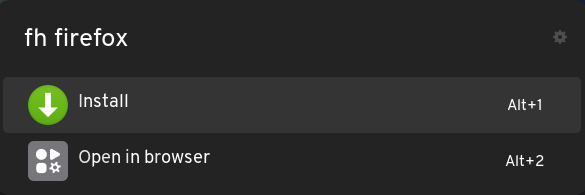

# Ulauncher Flathub Manager

## Features

- Search Flathub apps directly from Ulauncher
- Install, update, and remove Flatpak applications
- Receive desktop notifications for each operation

## Requirements

This extension requires [libnotify](https://gitlab.gnome.org/GNOME/libnotify), as it uses the `notify-send` command to display desktop notifications and [fzf](https://junegunn.github.io/fzf/) to filter installed flatpaks

## Demo

  
   
  <em>Search results from Flathub</em>

  
   
  <em>Application is already installed</em>

  
   
  <em>Application is not yet installed</em>

## Notifications

Notifications indicate whether an operation completed successfully or failed.

  
   
  <em>Install notification</em>

  
   
  <em>Update notification</em>

  
   
  <em>Remove notification</em>

